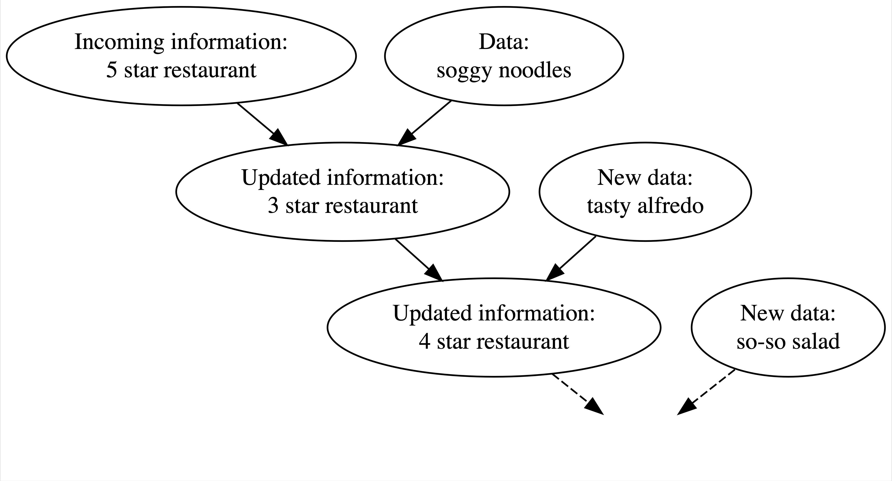

```{r setup, include=FALSE}
knitr::opts_chunk$set(echo = FALSE)
```

Gibbs Sampler involves working with conditional distributions - the core of Bayesian ideas. Let's take a look at Bayesian World and how they are connected.

# Background: Bayesian V.S. Frequentist {#about}

Frequentist is the dominant philosophy and category in the modern statistical world. In fact, many concepts/ thinking/ logic we have been exposed from statistics are from Frequentist beliefs, such as "confidence interval", "p-value", "the true value of an unknown parameter", etc. However, Gibb's sampler is a method that applies conditional probability distribution, where the "conditioned" nature indicates its Bayesian flavor. This page serves as a refresher to get a taste of Bayesian Statistics - we will briefly talk about its knowledge building process of estimating unknown parameters, learn Bayes rule, and do a little exercise on deriving the *posterior distribution* of an unknown parameter.

Unlike Frequentists who deem unknown parameters as unknown, fixed constants, Bayesians think about them as **random variables** and constantly changing their beliefs about unknown parameters based on the data we truly see - they start by proposing a possible probability distribution for the unknown parameter (**prior distribution**), and find out what they actually see from real data to update/ change the beliefs by deriving **posterior distribution** based on the prior distribution and data. Furthermore, by seeing more data, they continue to update their knowledge on the parameter (for example, shrink the parameter space/ support by lowering the plausibility of some values of which the parameter can take).

We can imagine the parameter is a Plasticine or modeling clay. When we buy a Plasticine from a store, it has its original shape (*prior* - the beginning hypothesis/ information we have about the parameter), and its shape constantly changes corresponding to the external forces applied (*data we've seen so far*). The resulted shapes are the *posterior* - the information we gained about parameter after seeing data.

The end goal of Bayesian estimation is not to see a convergence and shrinkage of parameter space and determine the most likely value of a parameter- that sounds like "Frequentist". In Bayesian, we never end updating the knowledge based on data.

Sounds like there is lots of "based on", "dependent on", and "after seeing..." in Bayesian - YES, this explains why our topic of Gibbs Sampling is contextualized on Bayesian side - Gibbs sampler involves with working with conditional distributions.

Figure below illustrates Bayesian knowledge-building process: [Johnson, A. et.al.](https://www.bayesrulesbook.com/chapter-1.html) If we heard from many 5-star reviews from a restaurant that you are going to visit, we may start expecting it to be a 5-star restaurant.

You sit down, and they serve you a really soggy noodles, you'd be upset and surprised - at the same time, you overthrow your previous assumption about the restaurant and thought it was really just a 3-star level. Then, they serve you a really yummy dish and you change your impression back to 4-star as for now... 



Through observing and changing, Bayesians are giving themselves more flexibility of estimating parameters of interest. They do estimations based on "Bayes rule" - a central idea and foundation of Bayesian statistics.

# Bayes Rule

Connecting back to probability terms, let's remind ourselves the Bayes rule of two events $A$ and $B$, generalized by equation below:

$$
P(A| B )= \frac{P(A\cap B)} {P(B)}=\frac{P(B|A)P(A)}{P(B)} 
$$

where:

-   $P(A)$ and $P(B)$ are the independent probabilities that they happen
-   $P(A\cap B)$ is the probability that both A and B happen
-   $P(B|A)$ is the conditional probability given A happens

By knowing the independent probabilities of $A$ and $B$, and seeing the probability of $B$ happens given A happens, we can derive what do we know about $A$ given B.

In Bayes, $A$ will reflect our known parameters, and $B$ will reflect our data. Let's take a further step to see how this connects to probability distribution as a whole.
 
# Use Bayes rule in probability distribution

Suppose we are interested in the unknown parameter $\theta$. How do we update our guess?

First, We start by proposing a **prior** distribution to the unknown parameter $\theta$: denote this as $p(\theta)$ if discrete or $f(\theta)$ if continuous. For example, if $\theta$ represents a probability, then one may suggest their prior to be $\theta \sim Unif(0,1)$. There is no right or wrong/ good or bad judgment calls to priors- they are completely subjective and based on personal knowledge/ background research to the parameter.

Next, we will incorporate our data by calculating the **likelihood** of seeing a sequence of observations $\vec{X}$ under $\theta$: denoted as $f(\vec{X}|\theta)$.

Thirdly, We are interested in **posterior distribution** of the parameter - update! Denote this as $g(\theta|\vec{X})$ to differentiate the updated distribution.

According to the Bayes rule, we can calculate the posterior distribution $g(\theta|\vec{X})$ by (suppose $X, \theta$ are both continuous random variables):

$$
g\left(\theta \mid \vec{X} \right) =\frac{f\left(\vec{X} \mid \theta\right) f(\theta)}{f(\vec{X})}
$$
where $f\left(\vec{X} \mid \theta\right)$ is the joint pdf/ likelihood given $\theta$ and the denominator $f(\vec{X})$ is the marginal pdf of $\vec{X}$.

Notice that the posterior distribution of $\theta$ does not depend on $\vec{X}$, that leads us to a convention in deriving the posterior distribution $g(\theta \mid \vec{X})$ because we can ignore the actual composition of $f(\vec{X})$ as it only serves as the normalizing constant in deriving a pdf for a random variable. Therefore:

$$
g\left(\theta \mid \vec{X} \right) \propto {f\left(\vec{X} \mid \theta\right) f(\theta)}
$$
Note that the pdf of posterior distribution of $\theta$ is **not equal** to the right hand side - we still need the marginal pdf of $\vec{X}$ to calculate the exact pdf. But the above equation gives us the *kernels* in a pdf - they are sufficient enough to let us find out the posterior distribution of $\theta$. 


## Exercise: deriving posterior distribution for $\theta$

Let's try a simple example (from Dr. Kelsey Grinde's in class material on Bayesian Statistics). Suppose we observed one random observation of a coin flip, $X\sim Bern(p)$, and we are interested in $p$, where we assume its prior distribution: $p \sim Beta (a,b)$. We derive the posterior distribution $g(p \mid X)$:

$$
\begin{aligned}
g(p|X)  &\propto f(X\mid p) f(p)\\
&= [p^X (1-p)^{1-X}] \quad [\frac{\Gamma(a+b)}{\Gamma(a)\Gamma(b)} p^{a-1} (1-p)^{b-1}]\\
& \propto p^X(1-p)^{1-X} p^{a-1}(1-p)^{b-1} \\
& =p^{X+a-1}(1-p)^{1-X+b-1} \\
& p \mid X \sim \operatorname{Beta}(X+a, 1-X+b) \\
&
\end{aligned}
$$

We only conserve terms with $p$ and dump anything else such as constants $a, b$. Notice how $a,b, X$ and the number of trial (1 in this case since we only have one random observation) are incorporated into the posterior distribution. 

The example above works with single unknown parameter $p$, and Gibbs sampling works with Bayesian to obtain posterior samples of *multiple* unknown parameters (many dimensions). Furthermore, it is noteworthy that Gibbs is only applied to situations when we have multiple unknown parameters and it is hard to calculate the *joint*, posterior distribution of all parameters using the method above (so we do not have a single posterior distribution, but many - this means we cannot derive i.i.d. samples but dependent samples), and it is easier/ feasible to derive their individual *conditional* posterior distributions. We will learn about it more on the next page!

