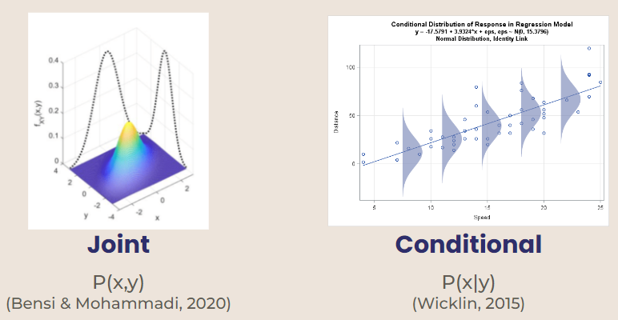

```{r setup, include=FALSE}
knitr::opts_chunk$set(echo = TRUE, cache = TRUE)
```
## Background  

# Probability Refresher
Gibbs sampling is used for multivariate distributions, or distributions that depend on more than one variable. Two types of multivariate distributions are joint and conditional.  

1. Joint Probability Distribution - probability based on two independent variables (ex. p(x, y))  

2. Conditional Probability Distribution - variables are dependent on each other (ex. p(x) given Y = y)  



# Markov Chain Monte Carlo (MCMC)  
Markov Chain Monte Carlo is used to estimate probabilities by simulating repetitions of an experiment. It is usually used in situations where an exact probability is difficult to calculate. [Larsen & Marx, 2018]

**MCMC: Metropolis Hastings**  
  Metropolis Hastings is a classic MCMC method used to obtain a sequence of random samples where the direct distribution is hard to find. In this method, a proposed distribution is utilized to sample new states. At each iteration, a new state is proposed. [Gunderson, 2020](https://gregorygundersen.com/blog/2020/02/23/gibbs-sampling/)  

  Metropolis Hastings also utilizes an *acceptance rate*. When you get a random sample, a probability equation is used to decide whether or not to accept the new, proposed values. Gibbs Sampling is a special case of Metropolis Hastings with conditional distributions and an acceptance rate = 1. This means that in Gibbs Sampling, the new proposed state is accepted 100% of the time. [Jingyi Jessica Li](http://www.stat.ucla.edu/~jingyi.li/statsm254-s14/Lecture11.pdf)  

## Concept {#gibbs}

Gibbs Sampling is a Markov Chain Monte Carlo (MCMC) method that that is used for multidimensional models. Gibbs is used when sampling using joint distributions is too difficult, but it is easy to sample from conditional probabilities.

**Gibbs Sampling Definition** Suppose we want to obtain $n$ samples of $X = (x_1, x_2, x_3, ..., x_m)$ from a joint distribution $p(x,y)$.

In Gibbs sampling, we will sample each $x^m$ conditional on others, that is, in iteration $(n+1)$:

$$
\begin{aligned} 
x_{n+1}^{(1)}&\sim P(x^{(1)}|x_n^{(2)},x_n^{(3)},...,x_n^{(m)}) \\
x_{n+1}^{(2)}&\sim P(x^{(2)}|x_{n+1}^{(1)},x_n^{(3)},...,x_n^{(m)}) \\
x_{n+1}^{(m)}&\sim P(x^{(m)}|x_{n+1}^{(1)},...,x_{n+1}^{(m-1)})
\end{aligned}
$$
  
**In Practice**   
1. Set $(x_0,y_0)$ to some starting value.  
2. Sample $x_1 \sim p(x|y_0)$. Alternatively, $X|Y = y_0$. This produces $(x_1, y_0)$.  
3. Then, sample $y_1 \sim p(y|x_1)$ to arrive at the second point in the distribution $(x_1,y_1)$  
4. Repeat steps 2 and 3, $M$ times.  
  
This produces a sequence of pairs of random variables, $(X_0,Y_0),(X_1,Y_1),(X_2,Y_2),...$, which satisfies the property of being a Markov chain. Note that the conditional distribution of $(X_i,Y_i)$, given all the previous pairs, only depends on $(X_{i-1},Y_{i-1})$ [Steorts](http://www2.stat.duke.edu/~rcs46/modern_bayes17/lecturesModernBayes17/lecture-7/07-gibbs.pdf)
  
**In a Bayesian Perspective**  
Gibbs Sampling can be used to simulate a Markov chain distribution of unknown parameter $\theta$. Let's call this distribution $\pi (\theta)$.

* Initial conditions
  + Suppose $\theta$ may be partitioned into $\theta = (\theta_1,...,\theta_r)$
  + It is then possible to simulate a random value of $\theta_i$ from a full conditional distribution $\pi(\theta_i | \theta_1, \theta_2, ..., \theta_{i-1},\theta_{i+1},...,\theta_r)$ for $i = 1, 2, ...$

* Use initial conditions to simulate the distribution $\pi (\theta)$
* Start with initial values $\theta^{(0)} = (\theta_1^{(0)},...,\theta_r^{(0)})$
* Then, use the following steps for $m = 1, 2, ...$:
  + Step 1: Sample $\theta_1^{(m)}$ from $\pi(\theta_1 | \theta_2^{(m-1)}, \theta_3^{(m-1)},..., \theta_4^{(m-1)})$
  
  + Step 2: Sample $\theta_2^{(m)}$ from $\pi(\theta_2 | \theta_1^{(m)}, \theta_3^{(m-1)},..., \theta_d^{(m-1)})$
  
  + Step r: Sample $\theta_r^{(m)}$ from $\pi(\theta_r | \theta_1^{(m)}, \theta_2^{(m)},..., \theta_{r-1}^{(m)})$

By the Monte Carlo rules, it is easy to show that if $\theta^{(m-1)}\sim \pi(\theta)$, then $\theta^{(m)}\sim \pi(\theta)$, and thus is the distribution $\pi (\theta)$. [Pritchard et al., 2000](https://web.stanford.edu/group/pritchardlab/publications/pdfs/PritchardEtAl00.pdf)


# Properties  

**Mixing Rate:** refers to how quickly the sample averages converge  

* Indicates converging to a reasonable probability distribution  

* A faster mixing rate means that the algorithm “mixes well”   
  
  
**Burn-In:** property of Metropolis Hastings MCMC  

* It takes a few trials to converge to a reasonable probability distribution  

* Must discard the first "B" samples that do not represent the data well  

* First "B" samples are referred to as the burn-in period  

* A good model will have a small burn in period   

  

# Limitations
Some potential limitations and situations where Gibbs sampling can’t be used would be in situations where there are areas of extremely high probability or of extremely low probability. By the nature of conditional probability distributions, if the current point lands in a high probability region, the next point won't move. This is because it is solely dependent on the previous point, and the entire sample space will be limited to this very high probability peak. 
  
On the other hand, in a low probability region, you won’t be able to find any higher probability regions either. This is because sampling fails when it comes across a region where probability = 0. If the probability of any data being at a certain value in a dimension is zero, then you won't be able to sample a new point in that dimension because the entire sample space will also have a probability of zero.


## A simulation example: Exponential and gamma model

# Set up

Consider an exponential model for our random observation
$X_1,...,X_n \stackrel{iid}{\sim} \text{Exponential}(ab)$ (where the
parameter $\lambda$ is the product of $a$ and $b$):

$$p(X_i|a,b) = abe^{-abx} \quad \text{for} (x>0)$$ $a$ and $b$ is our
unknown parameters. Now, suppose we put the following *independent*
priors on $a$ and $b$: $$a{\sim} \text{Gamma}(1,1)$$
$$b{\sim} \text{Gamma}(1,1)$$

*Recall from probability*: If random variable A has Gamma(1,1)
distribution, it has the pdf: $f_A(a) = e^{-a}$.

Therefore, since $a$ and $b$ are independent priors, we can calculate
joint distribution of our prior by simply multiplying their pdfs
together:

$$p(a,b) = e^{-a-b} \quad \text{for} (a,b>0)$$

## Why is conditional distribution easier than joint?

Remember: our unknown parameters/ interests are $a$ and $b$.

To start with, given the above, we really want to know what the joint
posterior distribution of $p(a,b|X)$ looks like. Unfortunately, however,
we can't. In fact, Kristy and Regan are going to claim that, instead of
directly sampling from the *joint* posterior distribution
$p(a,b|\vec{X})$, it is easier to sample from conditional distributions:
$p(a|\vec{X},b)$ and $p(b|\vec{X},a)$. (vector $X$ just means we are
interested at a random sample - a bunch of $X_i$s.)

Why? Let's write out their formulas:

Joint (hard!):

$$
p(a,b|\vec{X})=\frac{p(a,b,\vec{X})}{p(\vec{X})}
$$

Conditional (easy!):

$$
p(a|b,\vec{X}) = \frac{p(a,b,\vec{X})}{p(b,\vec{X})}
$$

Note that they're both proportional to the whole, joint distribution
$p(a,b,\vec{X})$. Let's calculate this: $$
\begin{aligned}
p(a,b,\vec{X})&= p(\vec{X}|a,b)*p(a,b)\\
&=\Pi_{i=1}^n p(X_i|a,b) * e^{-a-b}  \\ 
&= \Pi_{i=1}^n abe^{-abx_i} * e^{-a-b} \\ 
&= (ab)^n e^{-ab\sum_{i=1}^nx_i}* e^{-a}*e^{-b} \\
&= (ab)^n e^{-a(b\sum_{i=1}^nx_i+1)}* e^{-b}
\end{aligned}
$$ Let's start with the conditional distribution $p(a|b,\vec{X})$ that
works:

$$
\begin{aligned}
p(a|b,\vec{X}) &\propto p(a,b,\vec{X})\\
&=(ab)^n e^{-a(b\sum_{i=1}^nx_i+1)}* e^{-b}\\
&\propto a^ne^{-a(b\sum_{i=1}^nx_i+1)} \quad \quad\text{dump b-related terms}\\
\end{aligned}
$$

This is a Gamma distribution!

$$
a|b,\vec{X}\sim \text{Gamma}(n+1,b\sum_{i=1}^nx_i +1)
$$

Symmetrically, the conditional distribution of $b$ is the same: $$
b|a,\vec{X} \sim \text{Gamma}(n+1,a\sum_{i=1}^nx_i +1)
$$

**What about our joint, posterior distribution** $p(a,b|\vec{X})$? $$
\begin{aligned}
p(a,b|\vec{X}) &\propto p(a,b,\vec{X})\\
&=(ab)^n e^{-a(b\sum_{i=1}^nx_i+1)}* e^{-b}\\
\end{aligned}
$$ We can't dump any terms, and this does not look familiar.

## Getting to Gibbs

Relating back to Gibbs sampling, since we have two dimensions $a$ and
b\$, our Gibbs samples are: $(a_0, b_0)$, $(a_1, b_1)$, $(a_2, b_2)$,
...... $(a_n, b_n)$, where the $n^{th}$ sample $(a_n, b_n)$, will always
depend on the previous one $(a_{n-1}, b_{n-1})$, forming a Markov Chain.

We draw samples as: 1. Choose the initial sample $(a_0, b_0)$ 2. Draw
$a_1\sim p(a|b_0,\vec{X})$, $b_1\sim p(b|a_1,\vec{X})$ - this is
$(a_1, b_1)$ 3. Draw $a_2\sim p(a|b_1,\vec{X})$,
$b_2\sim p(b|a_2,\vec{X})$

This means, after seeing some data $\vec{X}$, where we said
$X_i\sim \text{Exponential}(ab)$, we will continuously draw posterior
samples, from two dimensions $a$ and $b$, based on the following
distribution ($N=$ number of random observation of $X$, $j=$ times of
iteration):

$$
a_{j+1}|b_{j},\vec{X}\sim \text{Gamma}(N+1,b_j\sum_{i=1}^nx_i
+1)
$$

$$
b_{j+1}|a_{j+1},\vec{X}
\sim \text{Gamma}(N+1,a_{j+1}\sum_{i=1}^nx_i +1)
$$

------------------------------------------------------------------------

# (continued) R: Gibbs Sampler

The following content is adapted from Dr. Grinde's in class activity on
Gibb's sampling. Here are the conditional distributions if needed:

$$
a_{j+1}|b_{j},\vec{X}\sim \text{Gamma}(N+1,b_j\sum_{i=1}^Nx_i
+1)
$$

$$
b_{j+1}|a_{j+1},\vec{X}
\sim \text{Gamma}(N+1,a_{j+1}\sum_{i=1}^Nx_i +1)
$$

## Set up

```{r}
set.seed(1)
# set up priors (mean)
a0 <- mean(rgamma(1000, shape = 1, rate = 1))
b0 <- mean(rgamma(1000, shape = 1, rate = 1))

# true data distribution
N <- 100  # 100 Xi observations
truea <- 3
trueb <- 4
X <- rexp(n = N, truea*trueb) #create 100 observations where X~exp(ab)

Xsum = sum(X) # for later use
```

Note that we are choosing to simulate a data distribution that matches our prior. Although this is unrealistic, it indicates that our Gibbs Sampling will be a good representation of our model.

```{r}
# store posterior samples of a and b
alphas <- c()
betas <- c()

# input a0, b0
# we are choosing the starting points to be the mean of our prior distribution
alphas[1] <- a0
betas[1] <- b0

# choose how many iterations of Gibbs sampling to run
j <- 1000
```

Note that we now choose our average prior values as our initial sample $(a_0, b_0)$ as our initial sample. We are drawing 100 iid observations of $X_i$s and running our Gibbs Sampling for 1000 iterations ($j$).

Since we already know that $(a=3, b=4)$ are the "correct" values for $(a,b)$, we can predict that our Gibbs sampling will fluctuate around these values.

## Run!

```{r}
# run for j (1000) iterations

for(i in 2:j){
# update a and b
a <- rgamma(n = 1, shape = N+1, rate = betas[i-1]*Xsum + 1)
alphas[i] <- a

b <- rgamma(n = 1, shape = N+1, rate = alphas[i]*Xsum + 1)
betas[i] <- b
}
```

## Visualizations

```{r}
# Histogram of samples
par(mfrow=c(1,2))
hist(alphas, xlab = expression(alpha), main = '')
hist(betas, xlab = expression(beta), main = '')
```
This looks correct because our true values of a and b are 3 and 4 respectively.  


*Trace Plot: the behavior of the samples over j iterations:*

```{r}
iterations <- 1:j
par(mfrow=c(1,2))
plot(alphas ~ iterations, xlab = 'Iteration', ylab = expression(alpha), type = 'l')
abline(h = a0, col = "red")
text(x=200, y=1.2, 'a0', col = "red")
abline(h = truea, col = "blue")
text(x=200, y=truea+0.2, 'True a', col = "blue")
plot(betas ~ iterations, xlab = 'Iteration', ylab = expression(beta), type = 'l')
abline(h = b0, col = "red")
text(x=100, y=1.3, 'b0', col = "red")
abline(h = trueb, col = "blue")
text(x=100, y=trueb+0.2, 'True b', col = "blue")
```

------------------------------------------------------------------------

## Analyzing algorithm performance

From observing the trace plot above, what can we say about our Gibbs Sampler's performance? What factors do you think that are involved in
shaping the trace plots?

*ANSWERS*: 
From observing our trace plots, we can say that our Gibbs Sampler is a good simulation to find our true values. We can see that even though it starts at our initial values, it quickly jumps to fluctuate around our true values. We could say that there is a burn in period of about 100 trials for both parameters because it takes about 100 trials to converge around the true values.  

Many factors can determine our trace plots. Observed data ("Xsum"), (the way of choosing) the starting values of both parameters, sample size ("N"), number of
iterations ("$j$") - if we run for enough long time, the samples will
converge and starting value does not matter that much. If we choose
wisely on starting value, it may takes us less time to see that the
values $a$ and $b$ converge (greater mixing rate: evidence of a good
MCMC algorithm performance) and their trace plots become stable.  

Noting that fluctuations are not necessarily bad. Mixing rate, which is
how fast that sample averages converage, determines MCMC performance.
Our trace plots could be improved by changing the initial starting
values, $a_0, b_0$, and factors mentioned above all come in to play in
determining the convergence shape of the trace plots.
